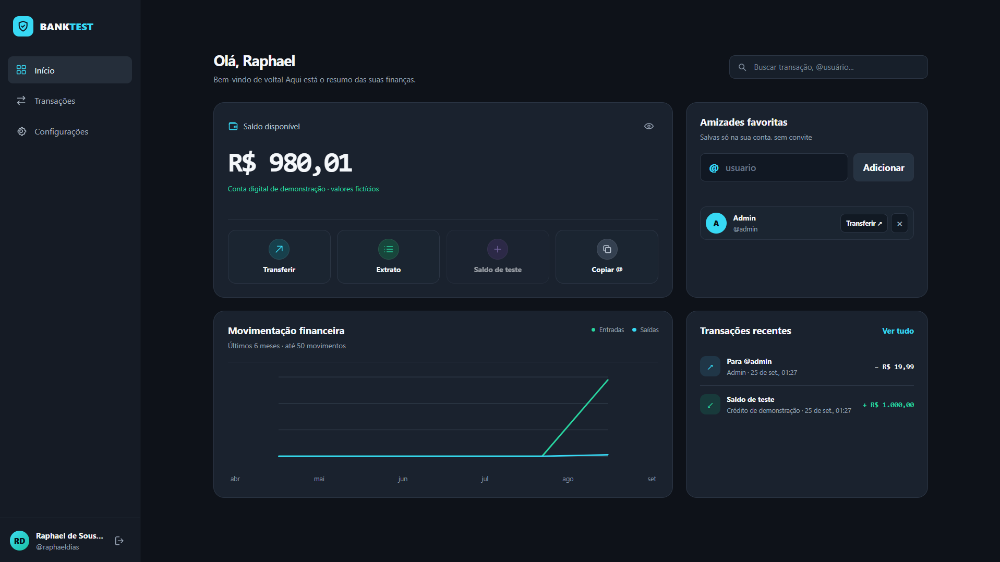

# BankTest

Mini banco local com cadastro, login por @usuário, transferências, extrato e amizades favoritas. O painel mostra saldo, movimentações, um gráfico dos últimos seis meses baseado nas 50 movimentações mais recentes e contatos salvos por você.



## Tecnologias

- Node.js 24+
- TypeScript
- SQLite local (`node:sqlite`)
- API HTTP e interface web sem frameworks

## Executar

No PowerShell do Windows:

```powershell
npm.cmd install
npm.cmd run dev
```

Em outros terminais, use `npm install` e `npm run dev`.

Acesse `http://localhost:3000`. O banco é criado automaticamente em `data/bank.db`. Cada conta pode receber uma única carga de R$ 1.000,00 fictícios para testar transferências. Nenhum dinheiro real é movimentado.

Para criar a conta local de demonstração `@admin` (`admin@gmail.com`, senha `admin`, saldo inicial de R$ 9.000.000,00), execute `npm.cmd run seed:admin`. O comando não altera uma conta `@admin` já existente nem repõe seu saldo. Essa senha é propositalmente fraca e **não deve ser usada em um servidor público**; troque-a em Configurações se for manter os dados.

O cadastro envia um código de 6 dígitos pelo Resend. A conta só é criada após a confirmação; o código expira em 10 minutos, aceita até 5 tentativas e pode ser reenviado após 1 minuto. Configure `RESEND_API_KEY` e `RESEND_FROM_EMAIL` em `.env` (o arquivo é ignorado pelo Git; veja `.env.example`). O remetente de teste `onboarding@resend.dev` só serve para testar o envio ao e-mail da sua conta Resend. Para enviar a outras pessoas, verifique um domínio no Resend e use um endereço desse domínio em `RESEND_FROM_EMAIL`.

No campo de transferência, o valor começa em `0,00` e cada dígito entra pelos centavos: `1` vira `0,01` e `100` vira `1,00`.

O login usa o @usuário em vez do e-mail. Contas antigas sem @usuário podem usar o link **Tenho uma conta antiga sem @usuário** na tela de entrada, acessar uma vez com e-mail e senha e escolher seu identificador. Depois disso, entram pelo @usuário. O @usuário deve ter de 3 a 24 caracteres, começar com uma letra e conter apenas letras, números ou `_`; maiúsculas e minúsculas são tratadas da mesma forma. Na interface, o `@` aparece fixo antes do campo.

Na aba **Configurações**, é possível alterar o e-mail e a senha informando a senha atual. Ao trocar a senha, as outras sessões são encerradas. A escolha entre tema claro e escuro fica salva neste navegador.

Em **Amizades favoritas**, adicione qualquer conta existente pelo @usuário, remova-a quando quiser e inicie uma transferência pela lista. O favorito pertence apenas à sua conta: a outra pessoa não precisa aceitar e não recebe uma amizade recíproca automaticamente.

## Endpoints

- `POST /api/auth/register` — `{ "name", "username", "email", "password" }`; inicia o cadastro e envia o código
- `POST /api/auth/verify` — `{ "email", "code": "123456" }`; confirma e cria a conta
- `POST /api/auth/resend-code` — `{ "email" }`; reenvia após 1 minuto
- `POST /api/auth/login` — `{ "username": "@seunome", "password" }`
- `POST /api/auth/legacy-login` — `{ "email", "password" }`, somente contas antigas ainda sem @usuário
- `GET /api/auth/me` — header `Authorization: Bearer <token>`
- `POST /api/auth/logout` — encerra a sessão atual
- `POST /api/account/username` — `{ "username": "@seunome" }`, apenas para contas antigas sem @usuário
- `PATCH /api/account/email` — `{ "email", "currentPassword" }`
- `PATCH /api/account/password` — `{ "currentPassword", "newPassword" }`
- `POST /api/account/demo-credit` — adiciona uma vez R$ 1.000,00 fictícios
- `GET /api/favorites` — lista suas amizades favoritas
- `POST /api/favorites` — `{ "username": "@raphaeldias" }`; adiciona um contato
- `DELETE /api/favorites` — `{ "username": "@raphaeldias" }`; remove um contato
- `POST /api/transfers` — `{ "recipientUsername": "@raphaeldias", "amountCents": 2500 }` envia R$ 25,00
- `GET /api/statement` — últimas 50 movimentações da conta
- `GET /api/health` — estado da API

Os valores são armazenados em centavos. Cada transferência debita, credita e registra a movimentação em uma transação única do SQLite. Senhas são derivadas com `scrypt`; tokens são aleatórios e somente seus hashes ficam no banco. Este projeto é uma simulação local. Para uso real, seriam necessários controles adicionais como HTTPS, autenticação reforçada e auditoria financeira.
